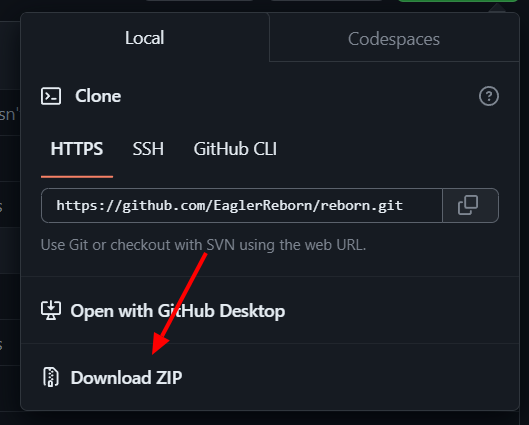

# Getting Started

## Pre-built clients

To play Eaglercraft you either use a website or an offline download  
The official place to go is [eaglercraft.com](https://eaglercraft.com), but there are several other options like [radmanplays.github.io](https://radmanplays.github.io)

:::info

Check out [the next page](./clients/) to find other clients (you might have to [build these yourself](#build-it-yourself))

:::

## Build it yourself

### 1. Choose your client

There are a lot of clients available for Eaglercraft.  
You can find some of them [here](./clients/) or use one of your own.

### 2. Clone the repo to your device

1. Press the code button  and head over to the <code>Local</code> tab.  
2. Click the <code>Download as ZIP</code> button  
3. Extract the zip-file to your location of choice

  

### 3. Compile the client

#### Windows

1. Make sure you have at least Java 11 installed and added to your PATH  
2. Double click CompileLatestClient.bat, a GUI resembling a classic windows installer should open  
3. Follow the steps shown to you in the new window to finish compiling  

#### Linux/Mac

1. Make sure you have at least Java 11 installed
2. Open a terminal in the folder the repository was cloned to
3. Type chmod +x CompileLatestClient.sh and hit enter
4. Type ./CompileLatestClient.sh and hit enter, a GUI resembling a classic windows installer should open
5. Follow the steps shown to you in the new window to finish compiling

#### linux (for developers only)
1. Make sure you have at least Java 11 installed
2. Open a terminal in the folder the repository was cloned to
3. type sudo apt install ffmpeg
4. (you can do the next 2 steps in one click by downloading [this file](https://raw.githubusercontent.com/radmanplays/eagler-docs/main/static/other/YoinkAssets.sh) and puting it inside of the root folder of the cloned repo and running it(press ctrl+s in the page to download it))
5. download minecraft 1.8.8 jar file from [here](https://launcher.mojang.com/v1/objects/0983f08be6a4e624f5d85689d1aca869ed99c738/client.jar) and json file from [here](https://launchermeta.mojang.com/mc/game/96f1789c25884755f4d3143d2e1364c9dded7d6b/1.8.8.json) and mcp from [here](http://www.modcoderpack.com/files/mcp918.zip) and put them in the mcp918 folder in the source code
6. change the name of the jar file from client.jar to 1.8.8.jar and the 1.8.8.json file to 1.8.json
7. type chmod +x build_init.sh
8. once it finishes type chmod +x build_make_workspace.sh
9. choose a folder to make the workspace in
10. (if you want to make a client etc... you can open the workspace folder and then src folder and you can find patched minecraft source code there)
11. open a terminal in the workspace folder
12. do ./gradlew teavm
13. wait for it to finish and do ./CompileEPK.sh
14. after that do ./MakeOfflineDownload.sh
15. the compiled offline download and web files should be in a javascript folder in the workspace

### 4. Have fun!

The offline download and web files should be generated inside the folder you selected for the output!
